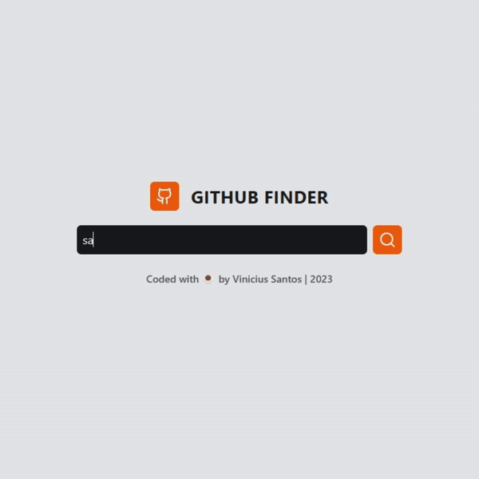

<p align="center">
  
</p>

<h2 align="center">Github Finder</h2>

> Next app to search Github profiles.

<p align="center">
  <a href="https://github.com/santos-vinicius/github-finder/blob/main/LICENSE" target="_blank">
    
  </a>
  <a href="https://twitter.com/sv1nicius" target="_blank">
    
  </a>
  
  
  
</p>

### 🏠 [Demo](https://githubprofile-finder.vercel.app/)

<p align="center">
  
</p>

### 📦 Usage

First, run the development server:

```bash
npm run dev
# or
yarn dev
# or
pnpm dev
```

Open [http://localhost:3000](http://localhost:3000) with your browser to see the result.

You can start editing the page by modifying `pages/index.tsx`. The page auto-updates as you edit the file.

### 🦄 Author

👤 **[Vinicius Santos](https://github.com/santos-vinicius)**

- Website: [santosvinicius.dev](https://github.com/santos-vinicius)
- Twitter: [@sv1nicius](https://twitter.com/sv1nicius)
- LinkedIn: [@santos-vinicius](https://linkedin.com/in/santos-vinicius)

### 💟 Show your support

> Give a ⭐️ if this project helped you!

To support the project directly, feel free to open issues for suggestions, or contribute with a pull request!

### 📑 License

Copyright © 2023 ✦ [Vinicius Santos](https://github.com/santos-vinicius) |
This project is [MIT Licensed](https://github.com/santos-vinicius/github-finder/blob/main/LICENSE).
